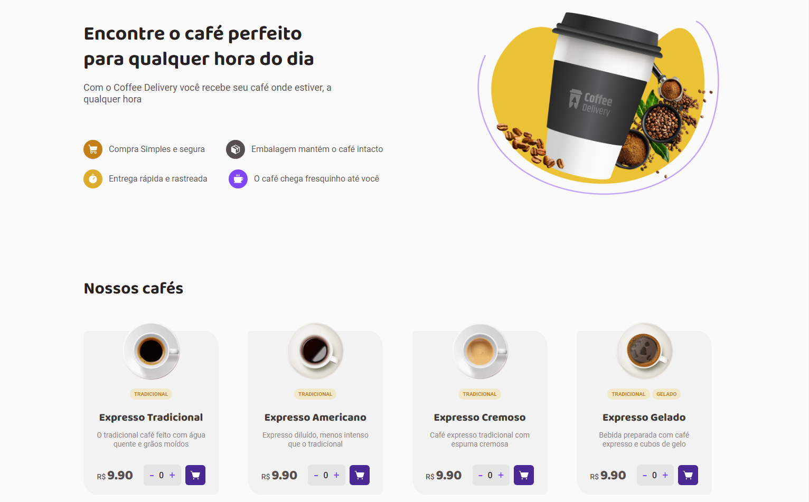
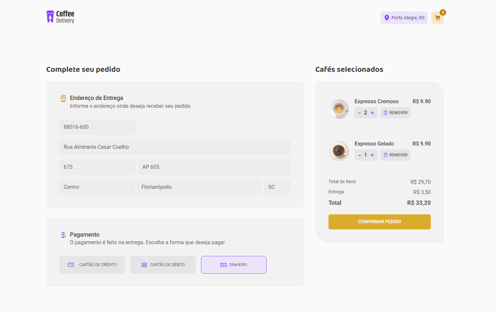
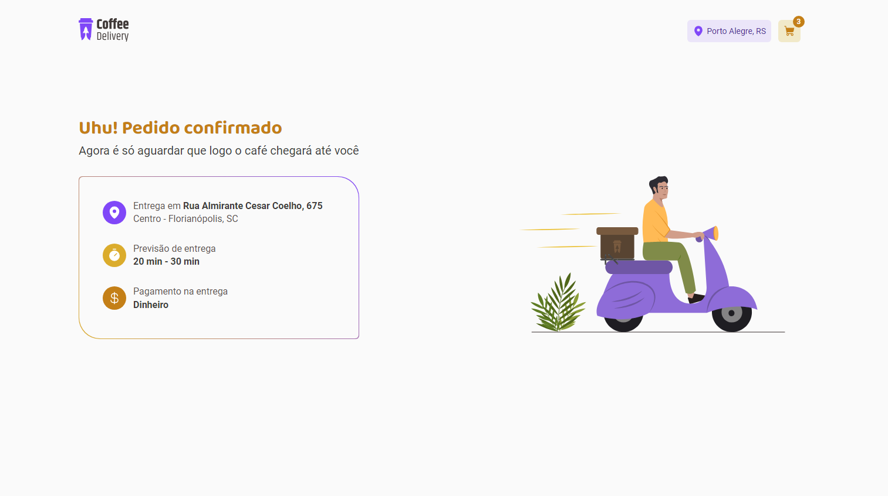

# Coffee Delivery ☕

Este projeto é uma aplicação web para um serviço de entrega de café, onde os usuários podem selecionar cafés, adicionar ao carrinho, escolher a forma de pagamento e confirmar o pedido. Após a confirmação, os detalhes do pedido e o método de pagamento são exibidos em uma tela de sucesso.

## Índice

- [Sobre o Projeto](#sobre-o-projeto)
- [Pré-requisitos](#pré-requisitos)
- [Como Executar](#como-executar)
- [Tecnologias Utilizadas](#tecnologias-utilizadas)
- [Funcionalidades](#funcionalidades)
- [Imagens do Projeto](#imagens-do-projeto)
- [Estrutura de Pastas](#estrutura-de-pastas)
- [Contribuindo](#contribuindo)
- [Licença](#licença)

## Sobre o Projeto

O Coffee Delivery é uma aplicação desenvolvida em React com TypeScript, utilizando Styled Components para a estilização. Ele permite que os usuários selecionem seus cafés favoritos e concluam um pedido simulando um processo de compra, com a possibilidade de escolher entre diferentes métodos de pagamento.

## Pré-requisitos

Antes de começar, você precisará ter o Node.js instalado em sua máquina.

- Node.js

## Como Executar

Siga os passos abaixo para rodar o projeto localmente:

1. Clone este repositório:

   ```bash
   git clone https://github.com/seu-usuario/coffee-delivery.git
   ```

2. Navegue até o diretório do projeto:

   ```bash
   cd coffee-delivery
   ```

3. Instale as dependências:

   ```bash
   npm install
   ```

4. Inicie a aplicação:

   ```bash
   npm run dev
   ```

5. Abra o navegador e acesse:

   ```arduino
   http://localhost:3000
   ```

## Tecnologias Utilizadas

- **React**: Biblioteca JavaScript para construir interfaces de usuário.
- **TypeScript**: Um superconjunto de JavaScript que adiciona tipos estáticos ao JavaScript.
- **Styled Components**: Biblioteca para escrever CSS em JavaScript, mantendo o escopo de componentes.
- **React Router**: Biblioteca para roteamento no React.
- **Zod**: Biblioteca de validação de dados com suporte a TypeScript.

## Conceitos e Práticas

- **useContext**: Hook do React para gerenciamento de estado global entre componentes.
- **useReducer**: Hook do React para gerenciamento de estados complexos.
- **Componentização**: Prática de dividir a interface em componentes reutilizáveis.
- **Gerenciamento de Estado Global**: Uso de Context API para compartilhar estado entre diferentes partes da aplicação.

## Funcionalidades

- **Seleção de Café**: Adicione diferentes tipos de café ao carrinho de compras.
- **Gerenciamento de Carrinho**: Aumente ou diminua a quantidade de cada item no carrinho e remova itens.
- **Formulário de Endereço**: Preencha o endereço de entrega.
- **Escolha de Pagamento**: Selecione o método de pagamento desejado.
- **Confirmação de Pedido**: Exibição de uma tela de sucesso com os detalhes do pedido.

## Imagens do Projeto





## Estrutura de Pastas

```bash
coffee-delivery/
│
├── src/
│   ├── assets/             # Arquivos estáticos e imagens
│   ├── components/         # Componentes reutilizáveis
│   ├── contexts/           # Contextos de estado global
│   ├── layouts/            # Layouts principais da aplicação
│   ├── pages/              # Páginas da aplicação
│   ├── styles/             # Estilos globais e temas
│   ├── App.tsx             # Componente principal
│   ├── main.tsx            # Ponto de entrada da aplicação
│   └── Router.tsx          # Configuração de rotas
│
├── public/                 # Arquivos públicos
├── .gitignore              # Arquivos e pastas ignorados pelo Git
├── package.json            # Configurações do npm e dependências
└── README.md               # Documentação do projeto

```

- Desafio proposto pela @Rocketseat
